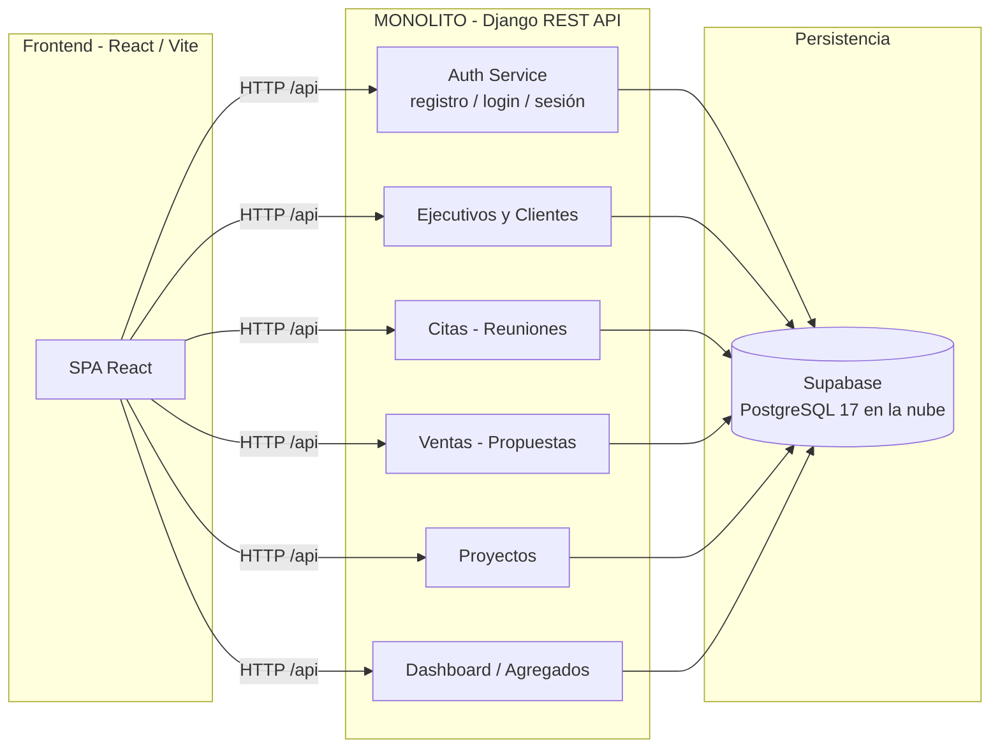
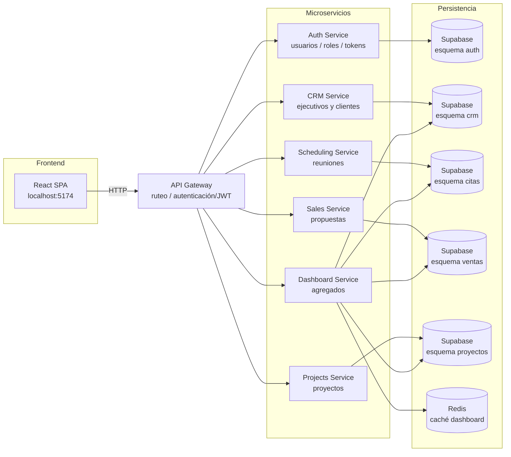
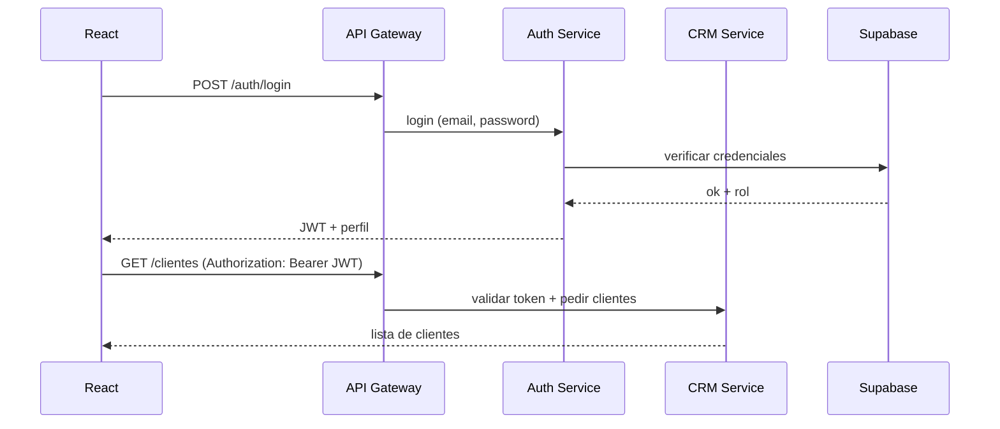

# DevPime — Diagrama de Microservicios

## 1. Arquitectura actual (Monolito)

Hoy todo el backend corre en un solo servicio Django REST que maneja autenticación,
ejecutivos, clientes, reuniones, propuestas, proyectos y el dashboard.

---

## 2. Propuesta de microservicios (división práctica)

División propuesta por dominios de negocio, manteniendo un solo frontend y un API Gateway.

---

## 3. ¿Qué es práctico dividir y qué no?

| Módulo | ¿Microservicio? | Razón |
|--------|:---------------:|-------|
| **Auth** | ✅ Sí | Primer candidato: se usa en todo, crece solo, puede usar Supabase Auth |
| **CRM** (ejecutivos + clientes) | ✅ Sí | Dominio de negocio independiente, datos propios |
| **Scheduling** (reuniones) | ⚠️ Eventual | Hoy es simple; dividirlo sin necesidad suma complejidad |
| **Sales** (propuestas) | ⚠️ Eventual | Depende de clientes; el acoplamiento es bajo, se puede separar |
| **Projects** | ✅ Sí | Alto acoplamiento con propuestas, buen candidato independiente |
| **Dashboard** | ❌ No | Solo agrega datos de los demás; usar caché (Redis) dentro del resto |

### Recomendación práctica

No dividas todo al inicio. Deja el monolito corriendo y extrae **por demanda** en este orden:

1. **Auth Service** → se convierte en el gateway de autenticación
2. **CRM Service** → primer dominio de negocio separado
3. **Projects Service** → cuando la lógica de proyectos crezca

> Regla: solo crea un microservicio cuando tengas un **equipo/dominio que crece solo** o una **razón técnica** (deploy independiente, escala distinta). Para un proyecto de este tamaño, un **monolito modular bien estructurado** (módulos Django con barreras claras) suele ser la mejor arquitectura.

## 4. Cómo sería el flujo de login (propuesta)

